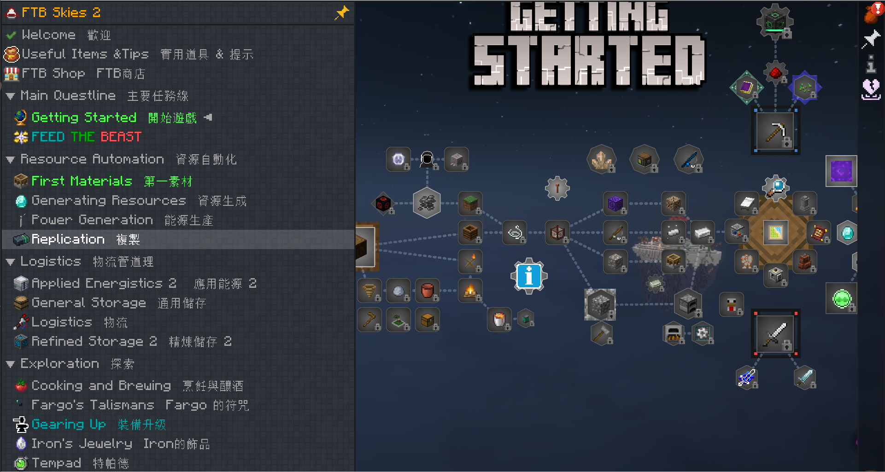

# 適用模組包

本翻譯包適用於模組包 [FTB Skies 2](https://www.curseforge.com/minecraft/modpacks/ftb-skies-2) 版本 1.6.0。

---

# 翻譯包說明

此翻譯包由 AI 協助翻譯而成，過程中可能會出現顏色代碼錯誤、翻譯不準確或簡體字等問題，還請見諒。

本翻譯檔為雙語版本（英文 + 中文），由於譯者不確定每個模組物品的正確翻譯，因此保留了原文，方便查詢物品名稱，還請理解。

譯者是在遊玩過程中同步校對，因此翻譯進度可能較為緩慢。  
如果你發現任何翻譯上的錯誤或有建議，歡迎隨時向譯者回報，我們會盡力改進。  
**如果回報錯誤時能附上截圖，將有助於譯者更快理解並處理問題，感謝你的協助！**  
回報問題請至 [GitHub Issue](https://github.com/huaven404/FTB_Skies2_QuestTranslation/issues/new) 頁面提交。

---

## 展示圖

如果你想更直觀了解本翻譯包的內容與效果，歡迎前往[YouTube](https://www.youtube.com/playlist?list=PLzKUwhCZmW2yl7bNz6pkolM33QRgnoXHh)觀看示範。

---

## 使用說明

- 請至 [Release 頁面](https://github.com/huaven404/FTB_Skies2_QuestTranslation/releases)下載最新版本。。  
- 若你是以中文（台灣）遊玩的玩家，請下載並使用 `zh_tw.snbt` 檔案。  
- 推薦使用 [Untranslated Items](https://www.curseforge.com/minecraft/mc-mods/untranslated-items)模組，方便查詢物品名稱。  
- 資料夾位置可參考圖片指引[資料夾](images/Folder.png)
- 請將翻譯檔放置於以下路徑：  
  `\FTB Skies 2\config\ftbquests\quests\lang`

---

## 授權條款 License

此翻譯包採用 MIT License，歡迎自由使用、修改及散布，詳情請見 LICENSE 檔案。  
如有侵權疑慮或其他問題，歡迎聯繫 huaven404@gmail.com。

---

> **轉發聲明：**  
> 如需轉發本翻譯包內容，請務必附上原出處連結及譯者資訊，感謝您的支持與尊重。

---

此翻譯包完全免費提供，感謝你的支持！
